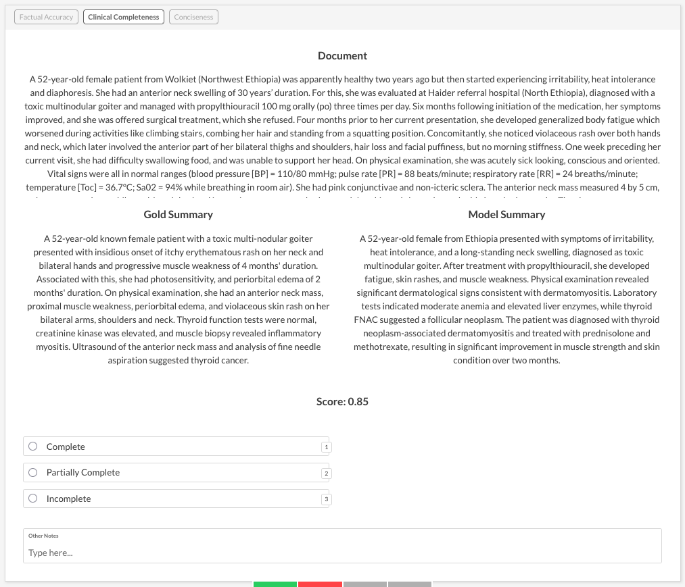
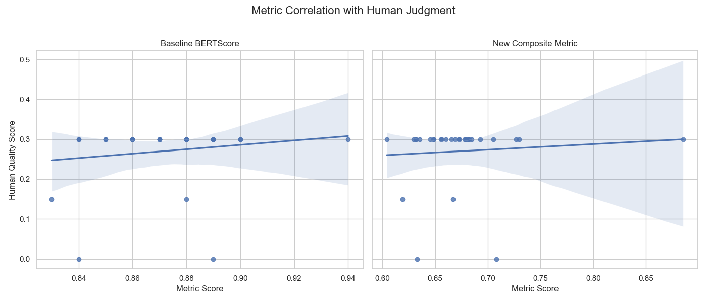
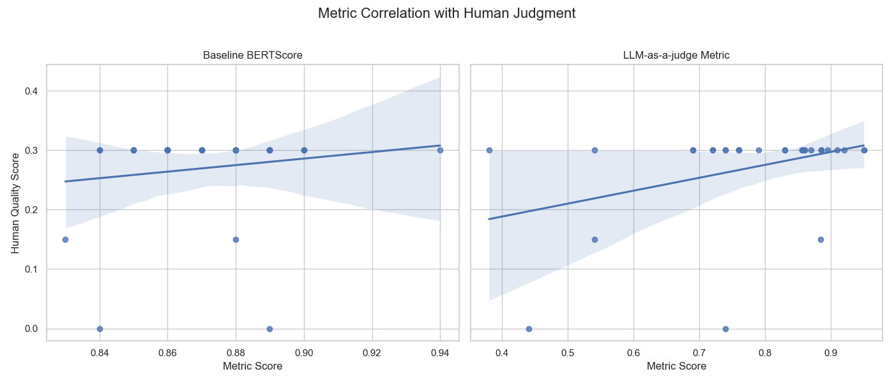

# Beyond Basic Metrics: Engineering a Human-Aligned LLM Evaluation Workflow with Prodigy and DSPy
Building reliable LLM systems is less about finding a "magic prompt" and more about establishing a rigorous, iterative development cycle. The DSPy framework is designed for precisely this, treating LLM pipelines not as brittle prompt chains, but as programs to be compiled and automatically optimized. It enables a methodical, iterative development of prompts, metrics and models, which is essential for structured experimentation. However, the quality of any automated optimization is fundamentally limited by the quality of the metric guiding it. This is where the loop needs human input.

My goal was to leverage Prodigy's powerful UI to create a tight, human-in-the-loop workflow, capturing nuanced human feedback on the metric and the baseline DSPy program performance and propagating it directly to the DSPy optimizer. To test this integrated approach, I chose the data from the [MultiClinSUM](https://temu.bsc.es/multiclinsum/) shared task organized by the Barcelona Supercomputing Center’s [NLP for Biomedical Information Analysis group](https://www.bsc.es/discover-bsc/organisation/research-departments/nlp-biomedical-information-analysis). MultiClinSUM is a multilingual (each language - English, Spanish, French, and Portuguese being evaluated independently) clinical reports summarization challenge with the goal to help healthcare professionals quickly understand key medical information.

The MultiClinSUM shared task provided a very relevant use case. Summarizing clinical notes is a high-stakes task where "quality" is context-specific. A good summary for a clinician's quick review needs different information than one for a patient's understanding or for an automated billing system. The quality is not absolute; it depends entirely on the summary's intended use. This ambiguity makes it a poor fit for generic, off-the-shelf metrics such as ROUGE-2 or BERTScore and an ideal candidate for a workflow where human judgment is used to engineer a custom, task-aligned evaluation metric.

This post documents tackling MultiClinSUM task using this integrated Prodigy-DSPy workflow. I'll move beyond generic metrics to show how you can use Prodigy and DSPy to systematically engineer a custom, human-aligned metric and use it to both guide and validate a DSPy program, resulting in an LLM system that is not just coherent, but truly useful for its intended purpose.


## Step 1: Collecting granular human feedback with Prodigy

The first step was to define a baseline **DSPy program** for summarization and an initial **metric** to guide it. For the metric, I chose **BERTScore**. This was motivated by the MultiClinSUM shared task itself, where organizers use BERTScore and ROUGE-2 (as well a couple of other, undisclosed metrics) for evaluation. For this experiment I discarded ROUGE-2 due to its reliance on exact lexical overlap, which makes it less adequate for understanding synonyms and paraphrasing (Citarella et al., 2025). BERTScore, which leverages contextual embeddings to measure semantic similarity, is a much stronger and more modern baseline (Fabbri et al. 2020).

<details>
<summary>Show Baseline DSPy Summarization Program</summary>

```python
class ClinicalSummarySignature(dspy.Signature):
    """Summarize a clinical case report."""
    document: str = dspy.InputField(desc="The clinical case report to summarize.")
    summary: str = dspy.OutputField(desc="A concise summary of the report.")

class SummarizationProgram(dspy.Module):
    """A simple program that uses a chain-of-thought prompt to summarize a document."""
    def __init__(self):
        super().__init__()
        self.generate_summary = dspy.ChainOfThought(ClinicalSummarySignature)

    def forward(self, document: str):
        return self.generate_summary(document=document)
```
</details>

For the development set I sampled 30 examples from the MultiClinSUM English train set (downloaded from [here](https://zenodo.org/records/15546018))

Running the baseline program against the development set yielded a realitvely high BERTScore of **87.19** with GPT-4o-mini. On the surface, this looked like a great start.

To understand the *actual* quality of the summaries, I performed a qualitative review. I decided to evaluate the summaries based on the following aspects:
* **Factual accuracy:** Is the information correct?
* **Clinical completeness:** Does it include all critical information?
* **Conciseness:** Is it succinct and to the point?

For this I created a custom Prodigy UI, that would allow me to compare the model generated summaries with the human made summaries from MultiClinSum dataset and the source document. To prevent clogging the UI with multiple sets of `choice` blocks, I used Prodigy's [`pages`](https://prodi.gy/docs/api-interfaces#pages) UI that allows for convenient switching between the 3 evaluation aspects: 


It's important to note that these criteria are subjective and tied to **my specific goal** for the summaries. There's no such thing as a "good summary" in an abstract, ideal sense. The question is always good _for what_. A practicing clinician prioritizing differential diagnoses might choose different aspects, while a billing specialist would focus on another set entirely. This context-dependency is precisely why off-the-shelf metrics often fail. General metrics can distinguish totally irrelevant outputs from okay ones, but to get from "okay" to "good" you need something application-specific.


## Step 2: Synthesizing human feedback with an LLM Assistant

After analysing 30 summaries I had an idea of what aspects were missing from the baseline DSPy Program but I now needed to translate that fragmentary, qualitative feedback into concrete improvements to the metric function to make sure the DSPy optimizer "climbs the right hill". A powerful feature of the upcoming **Prodigy-DSPy plugin** is the ability to use an LLM to analyze this feedback and provide concrete advice for improving your metric.

I fed my collected feedback and the baseline metric (BERTScore) into this analysis tool. The LLM provided a concise summary of the failure patterns and a direct suggestion for a better metric.

Here is the console output from the tool:
```bash
============================= Generated Feedback =============================
✔ 💡 Hint:
The model frequently struggles with clinical completeness, often omitting
critical details necessary for accurate understanding and diagnosis. Enhancing
the model's ability to identify and include these key clinical elements in
summaries could significantly improve its performance.

======================== Generating Metric Suggestion ========================
╭────────────────── 🔬 Suggestion for Improving your Metric Function ──────────────────╮
│ To improve the baseline_summary_metric, we can enhance its ability to evaluate   │
│ clinical completeness by incorporating a mechanism that checks for the presence │
│ of key clinical elements in the summary. This can be achieved by creating a list │
│ of essential clinical terms or phrases that should be present in the summary.    │
│ The metric can then score the summary based on the number of these key elements  │
│ it contains, in addition to the existing BERTScore for factual accuracy.         │
│                                                                                  │
│ Here’s a revised version of the metric function that includes this enhancement:  │
│                                                                                  │
│ ```python                                                                        │
│ def enhanced_summary_metric(gold: dspy.Example, pred: dspy.Prediction) -> float: │
│     from bert_score import score                                                 │
│                                                                                  │
│     if not pred.summary or not gold.summary:                                     │
│         return 0.0                                                               │
│                                                                                  │
│     # Calculate BERTScore                                                        │
│     P, R, F1 = score([pred.summary], [gold.summary], lang="en", verbose=False)   │
│     bert_score = F1.item()                                                       │
│                                                                                  │
│     # Define key clinical terms to check for completeness                        │
│     key_clinical_terms = [                                                       │
│         "diagnosis", "treatment", "symptoms", "findings", "prognosis",         │
│         "intervention", "complications", "pathology", "clinical", "history"    │
│     ]                                                                            │
│                                                                                  │
│     # Check for the presence of key clinical terms in the predicted summary      │
│     completeness = sum(term in pred.summary.lower() for term in key_clinical_terms)
│     completeness_score = completeness / len(key_clinical_terms)                  │
│                                                                                  │
│     # Combine BERTScore and completeness score (weighted as needed)              │
│     final_score = (bert_score + completeness_score) / 2 # Adjust weights         │
│                                                                                  │
│     return final_score                                                           │
│ ```                                                                              │
│                                                                                  │
│ This function calculates a completeness score based on the presence of key       │
│ clinical terms in the predicted summary and combines it with the BERTScore to    │
│ provide a more comprehensive evaluation of the summary's quality.                │
╰──────────────────────────────────────────────────────────────────────────────────╯
```
This LLM-generated advice gave me a potential path forward. It's important to critically evaluate such suggestions, and the proposed `enhanced_summary_metric` certainly has serious limitations. The hard-coded `key_clinical_terms` list is generic and not context-specific to each clinical note, and the simple keyword search is too brittle to handle synonyms or paraphrasing.

Despite these implementation flaws, the suggestion was valuable because it correctly identified the core conceptual problem: our evaluation had to explicitly account for clinical completeness. This insight, rather than the literal code provided, guided the next steps.

## Step 3: Quantifying human judgment

Following this advice, my next step was to implement a new "composite metric" to incorporate some notion of completeness. Rather than a key word list, I used a `scispacy` NER component. I also wrote the function to quantify my human feedback into a single score, which would serve as the reference for the correlation analysis.

<details>
<summary>Show human score computation</summary>

```python
def calculate_human_score(feedback: dict) -> float:
    """
    Converts the structured human feedback into a numerical score.
    Weights are informed by the LLM analysis, prioritizing completeness.
    """
    score = 0.0
    
    # Define score mappings for each criterion
    accuracy_scores = {"Correct": 1.0, "Minor Error": 0.5, "Major Error": 0.0}
    completeness_scores = {"Complete": 1.0, "Partially Complete": 0.5, "Incomplete": 0.0}
    conciseness_scores = {"Good": 1.0, "Too Long": 0.5, "Too Short": 0.5}

    # Assign weights based on the LLM's advice
    weights = {
        "completeness": 0.5, 
        "accuracy": 0.3, 
        "conciseness": 0.2
    }

    # Calculate the final weighted score
    score += weights["accuracy"] * accuracy_scores.get(feedback.get("factual_accuracy"), 0)
    score += weights["completeness"] * completeness_scores.get(feedback.get("clinical_completeness"), 0)
    score += weights["conciseness"] * conciseness_scores.get(feedback.get("conciseness"), 0)
    
    return score
```
</details>

<details>
<summary>Show composite score computation</summary>

```python
def make_composite_metric():
    nlp = spacy.load("en_core_sci_lg")

    def composite_clinical_metric(gold: dspy.Example, pred: dspy.Prediction, trace=None) -> float:
        """
        Calculates a composite score based on BERTScore (semantic similarity) and
        entity overlap (clinical completeness).
        """
        from bert_score import score
        gold_summary = gold.summary
        pred_summary = pred.summary
        
        if not pred_summary or not gold_summary:
            return 0.0

        # 1. BERTScore for semantic similarity
        _, _, F1 = score([pred_summary], [gold_summary], lang="en", verbose=False)
        bert_f1 = F1.item()

        # 2. Entity overlap for clinical completeness
        gold_entities = extract_entities(gold_summary, nlp)
        pred_entities = extract_entities(pred_summary, nlp)
        
        if not gold_entities:
            completeness = 1.0
        else:
            completeness = len(gold_entities.intersection(pred_entities)) / len(gold_entities)

        # 3. Combine scores (70% semantic, 30% completeness)
        composite_score = (0.7 * bert_f1) + (0.3 * completeness)
        return composite_score

    return composite_clinical_metric
```
</details>

## Step 4: Validating the metric: Is it actually better?

With my human judgments now quantified into a single score, I could run a correlation analysis to see how the baseline BERTScore and the composite score align with what I care about.



As the plots reveal, neither metric was effective:

1. Baseline BERTScore (Left Plot): This metric showed almost no correlation with human judgment (Spearman's ρ of 0.14), proving it was blind to critical failures.

2. NER Composite Metric (Right Plot): Our more advanced attempt was still unsuccessful, showing an even lower correlation (Spearman's ρ of ~0.12). While NER-based entity overlap is a good idea, it can be too strict. It often fails to match entities that are semantically similar but textually different (e.g., "heart failure" vs. "cardiac arrest"), ultimately adding noise instead of a clear signal for completeness.

That said, I now had a definitive proof that a simple, off-the-shelf metric wasn't good enough, and a more domain-specific composite metric using heuristics such as NER was insufficient. This failure motivated the need iterate on the metric.


## Step 5: Engineering a superior metric with LLM-as-a-Judge

The failure analysis above showed that a simplistic, rule-based approach for "completeness" wasn't enough. I wanted to expermint with "LLM-as-a-judge" pattern as this hopefully could result in better sensitivity to my chosen aspects.

Why should "LLM-as-a-judge" work, in theory? If the LLM is able to tell good outputs from bad ones, why can't it just generate a better output to start with? The key point is that for most tasks, evaluation is a one-way function: it's a lot easier to say what score an output should get than it would be to say what output would get some score. This makes a generate-and-evaluate loop fundamentally more powerful than a single step of generation.

Integrating LLM-as-a-judge into a metric is extremely easy with DSPy. What's needed is essentially a dedicated DSPy Program, in this case, with a DSPy signature that asks an LLM to perform a holistic evaluation, considering all our criteria (accuracy, completeness, conciseness) and their relative importance.

<details>
<summary>Show LLM-as-a-judge metric</summary>

```python
class HolisticQualityAssessment(dspy.Signature):
    """Evaluate the overall quality of a predicted clinical summary against a gold summary.
    
    Consider the following three criteria in this order of importance:
    1.  **Factual Accuracy:** Is the information correct? A single major factual error makes the summary very poor.
    2.  **Clinical Completeness:** Does it include all critical information (diagnoses, outcomes)?
    3.  **Concisiveness:** Is it succinct and to the point?

    Evaluate the predicted summary along these three dimensions, scoring each from 0 to 1:

    1. Factual accuracy (0-1)
    2. Clinical completeness (0-1)
    3. Conciseness (0-1)

    Then compute holistic_quality_score = 0.5*factual + 0.3*completeness + 0.2*conciseness
    """
    gold_summary: str = dspy.InputField(desc="The trusted, high-quality reference summary.")
    predicted_summary: str = dspy.InputField(desc="The summary generated by the model to be evaluated.")
    factual_score: float = dspy.OutputField()
    completeness_score: float = dspy.OutputField()
    conciseness_score: float = dspy.OutputField()
    holistic_quality_score: float = dspy.OutputField()

@registry.dspy_metrics.register("holistic_llm_metric.v1")
def make_holistic_llm_metric():
    def holistic_llm_metric(gold: dspy.Example, pred: dspy.Prediction, trace=None) -> float:
        """Uses a single, holistic LLM call to evaluate summary quality."""
        holistic_judge = dspy.Predict(HolisticQualityAssessment)

        gold_text = getattr(gold, "summary", None)
        pred_text = getattr(pred, "summary", None)
        if not gold_text or not pred_text:
            return 0.0
        try:
            result = holistic_judge(gold_summary=gold_text, predicted_summary=pred_text)
        except Exception as e:
            print("Holistic judge failed:", e, gold_text, pred_text)
            return 0.0
        score = getattr(result, "holistic_quality_score", None)
        try:
            return float(score)
        except (TypeError, ValueError):
            return 0.0
    
    return holistic_llm_metric
```
</details>


I then re-ran the correlation analysis, comparing this new "LLM-as-a-judge" metric against the baseline BERTScore:


**Important caveat**: the development set consisted of only 30 examples, so these correlations should be interpreted cautiously. Small sample sizes make correlation estimates unstable, and minor changes in the data could shift the values noticeably.

That said, the qualitative trend is clear:

The right plot shows a visibly stronger trend. Importantly, the LLM-as-a-judge metric correctly identifies the worst summaries — those with human scores of 0.0 — by assigning them very low metric scores (e.g., 0.4), a task the baseline metric completely failed to do.

For completeness, here are to coefficient values:
* Baseline BERTScore (Spearman's ρ): 0.1431
* LLM-as-a-judge Metric (Spearman's ρ): 0.2770

While a ρ of 0.28 is modest in absolute terms, it represents a meaningful alignment with human judgment for this small sample. It was definitely a move in the right direction. Future experiments on larger sets are needed to confirm and robustly quantify this correlation, but the qualitative improvement is already sufficient to guide metric-driven optimization.Interestingly, metrics which in themselves are DSPy programs can also be optimized as a part of the entire peipeline, which is defnitely an interesting follow-up experiment.

## Step 6: Optimizing the program with the improved metric and human feedback

With the LLM-as-a-judge metric and feedback-rich Prodigy dataset, I could now run a DSPy optimizer (like GEPA) to compile the program, automatically tuning its prompts to maximize the human-aligned metric.

It's worth pointing out that the optimization process had two significant features:

1. I was now optimizing against the superior **LLM-as-a-judge metric**, not the flawed baseline. This should ensure that the optimizer is aiming for my definition of quality.
2. I was passing the granular, example-level **human feedback** from Prodigy directly into the optimizer's trace. FYI, this also is a powerful, built-in feature of the Prodigy-DSPy plugin.

This second point is crucial. Some DSPy optimizers, in particular, [`GEPA`](https://dspy.ai/api/optimizers/GEPA/overview/) can use this qualitative feedback to understand *why* a given prediction was good or bad, leading to more grounded prompt suggestions. The text input box with free form comments per evaluation aspect were particularly useful for this.

The plugin accomplishes this with a wrapper function, `create_feedback_metric`. Instead of feeding our LLM-as-a-judge metric directly to the optimizer, the plugin wraps it and feeds the post-processed feedback to the `dspy.Prediction`:

```python
def create_feedback_metric(original_metric: Callable) -> Callable:
    """
    Wraps a DSPy metric to find per-example feedback and include it
    in a dspy.Prediction object returned to the optimizer.
    """
    def metric_with_feedback(gold: dspy.Example, pred, trace=None) -> dspy.Prediction:
        # 1. Calculate the score using the original metric (e.g., our LLM judge)
        score = original_metric(gold, pred, trace)

        # 2. Find the feedback string on the gold example
        feedback_str = getattr(gold, "feedback", "")

        # 3. Return a dspy.Prediction object containing BOTH score and feedback
        return dspy.Prediction(score=float(score), feedback=feedback_str)

    return metric_with_feedback
```
For each example in the development set, it first calls the LLM judge to get a score, then it finds the raw human feedback collected in Prodigy (which was attached to the `dspy.Example`), and finally, it bundles them together into a `dspy.Prediction` object.

This actually is what makes the workflow so powerful. The nuanced, qualitative judgments, captured in the Prodigy UI, are now directly informing the automated optimization process, creating a tight, effective human-in-the-loop cycle.

## Final Evaluation: Did it all work?

The ultimate test was to evaluate the performance of the `baseline program` and the `optimized program` on a held-out test set of 100 examples providing a more robust measurement of improvement. I evaluated both programs using both metrics: the problematic BERTScore and the LLM-as-a-judge metric.

| Program Version             | Measured by Baseline Metric (BERTScore) | Measured by **Our LLM Judge Metric** |
| :-------------------------- | :-------------------------------------- | :----------------------------------- |
| **Baseline Program** | 87.19                                   | 53.90                                |
| **Optimized Program** | 87.27 **(+0.08)** | 68.07 **(+14.17)** |


The human-aligned LLM judge metric revealed a substantial ~26% improvement in quality. This improvement was not captured by BERTScore at showing only a negligible +0.08 point improvement.

It's clearly not only about the program optimization but also about understanding **your** notion of quality and developing aligned metrics becayse summarization evaluation is a function with three inputs: the original text, the summary, and _you_: what are you looking to find out from the text? Without operationalizing the task-specific notion of quality, it's next to impossible to observe and measure the progress, beyond discarding totally irrelevant outputs.

## Conclusion: The power of human-aligned evaluation


1.  **Standard metrics are often insufficient** for complex, nuanced tasks, failing to capture what truly matters to human users.
2.  **Granular human feedback is indispensable** for understanding model deficiencies and guiding metric development. A well designed UI for capturing this feedback is an indispensible tool for this.
3.  **LLM-as-a-Judge metrics, carefully engineered with human insight, can become powerful, human-aligned evaluators.** They can potentially understand the subtle interplay of quality attributes far better than simple rule-based or statistical metrics.

# References
1. Citarella, Alessia Auriemma, et al. "Assessing the effectiveness of ROUGE as unbiased metric in Extractive vs. Abstractive summarization techniques." Journal of Computational Science 87 (2025): 102571.
2. Alexander R. Fabbri, Wojciech Kryściński, Bryan McCann, Caiming Xiong, Richard Socher, Dragomir Radev; SummEval: Re-evaluating Summarization Evaluation. Transactions of the Association for Computational Linguistics 2021; 9 391–409. doi: https://doi.org/10.1162/